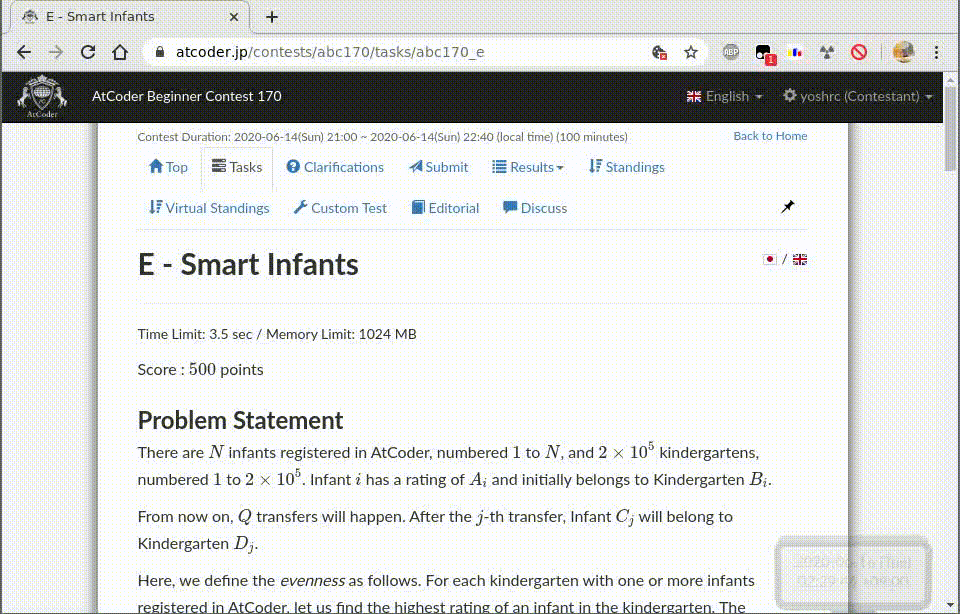

# atcoder-refactor

Rewrites variable names in AtCoder problem statements.

Some problems on AtCoder abuse confusing naming for variables, such as *A*, *B*, *C* and *D*. You can rewrite variable names by this plugin, then use the names in your code without remembering which name in the code corresponds to which variable in the problem.

# Usage

1. Install [Tampermonkey](https://tampermonkey.net/) on your browser.
2. Go to [this page](https://greasyfork.org/en/scripts/405398-atcoder-refactor) and install atcoder-refactor.
3. On problem statement, click a variable name and enter a name you prefer.
